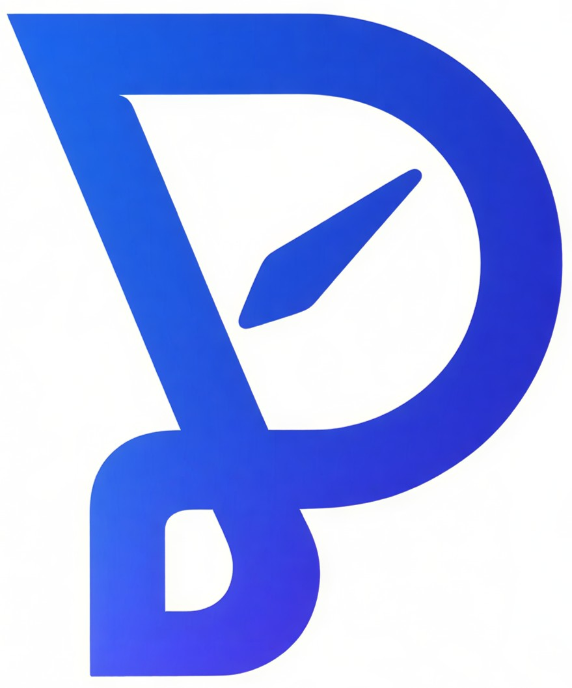
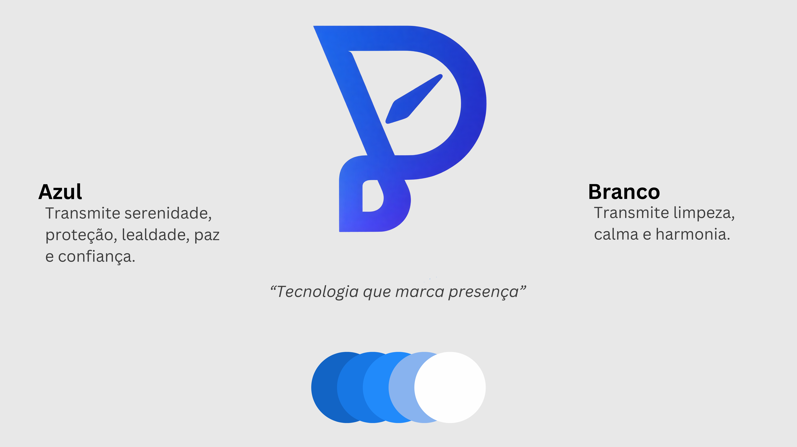
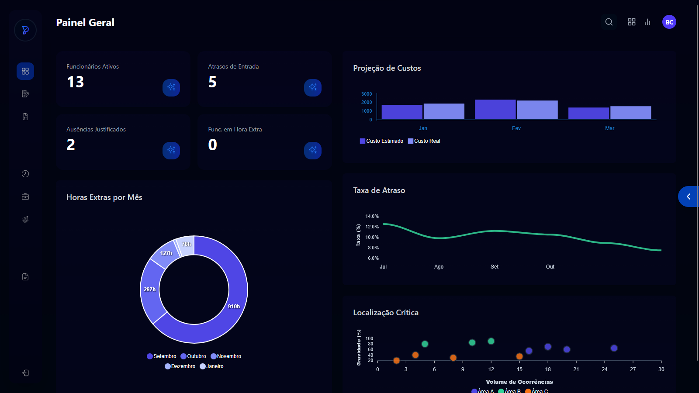
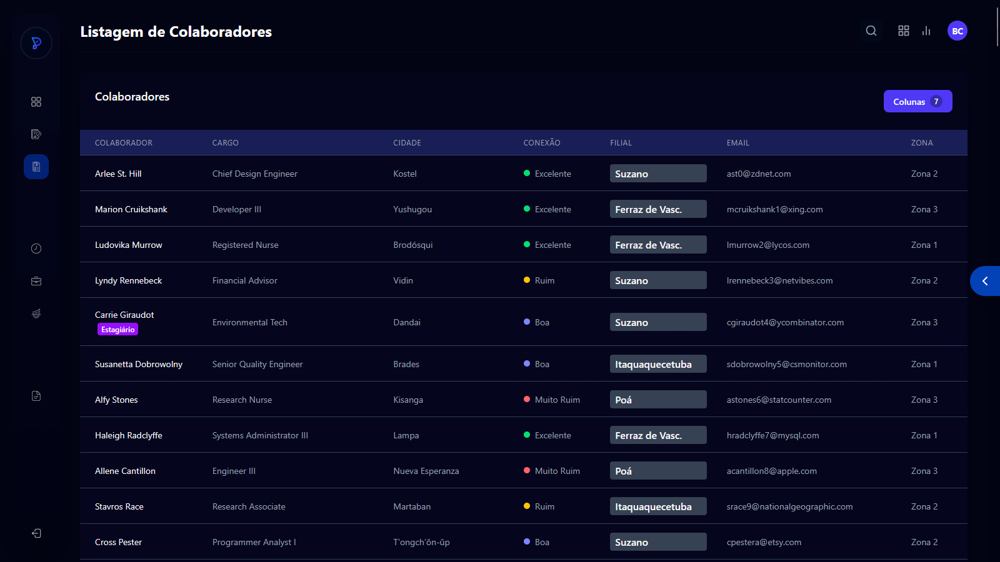
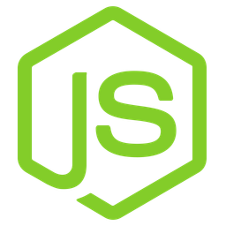
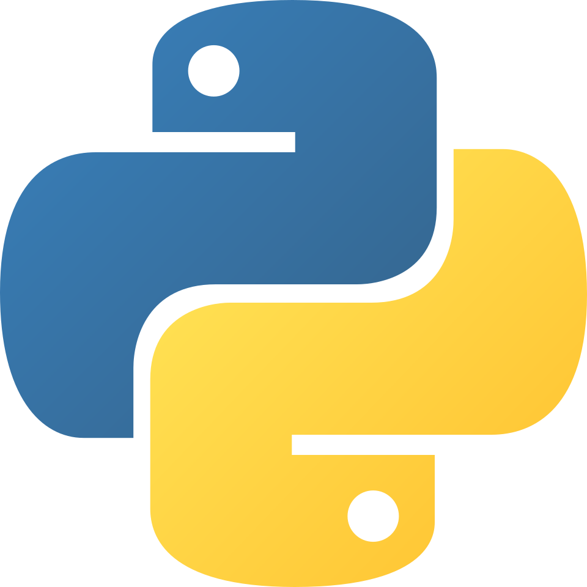

# 🚀 PoinTr — Sistema de Ponto Digital

  

  <strong><em>Tecnologia que marca presença</em></strong>

  Sistema inteligente de controle de ponto para micro e pequenas empresas

  
  
  

---

## 📖 Sobre o Projeto

A **PoinTr** é uma solução de ponto eletrônico desenvolvida para micro e pequenas empresas que ainda utilizam métodos manuais ou sistemas complexos e caros para controle de jornada.

O sistema permite registrar, acompanhar e gerenciar a jornada de trabalho dos colaboradores de forma simples, segura e acessível, reduzindo erros operacionais e otimizando processos administrativos.

A plataforma é dividida em duas experiências:

-  **Aplicativo mobile:** voltado para os colaboradores, com foco em rapidez e facilidade no registro de ponto  
-  **Plataforma web:** voltada para gestores, permitindo controle completo das lojas e análise de dados  

A ideia surgiu a partir de uma necessidade real de mercado, identificada em uma empresária que enfrentava dificuldades com controle manual de ponto em múltiplas unidades.

---

## 🎨 Identidade Visual

  

As cores da PoinTr foram escolhidas para transmitir tecnologia, confiança e simplicidade.

---

## 🎯 Objetivo Geral

Desenvolver uma plataforma digital prática e acessível para o registro e gerenciamento de ponto eletrônico, promovendo maior controle, organização e eficiência na gestão de equipes.

---

## 🚀 Objetivos Específicos

- Permitir o registro de ponto digital (entrada, saída e pausas)  
- Facilitar o gerenciamento de funcionários e permissões  
- Gerar relatórios automáticos de jornada de trabalho  
- Reduzir erros comuns em controles manuais  
- Garantir maior confiabilidade com validações (ex: geolocalização)  
- Oferecer uma interface simples e intuitiva  
- Possibilitar acesso via web e dispositivos móveis  

---

## 🧩 Portfólio (Mobile)

### 📱 Tela inicial de login

  

- **Função:** autenticação de acesso do gestor  
- **Destaque:** interface simples e objetiva  

---

### 🔐 Telas de login e verificação

  

- **Função:** validação de acesso por código  
- **Destaque:** camada adicional de segurança  

---

### 📭 Tela de gestão de loja (vazia)

  

- **Função:** estado inicial sem dados  
- **Destaque:** orientação visual para novos usuários  

---

## 💻 Portfólio (Desktop)

### 🌙 Tela de login (tema escuro)

  

- **Função:** acesso do gestor  
- **Destaque:** design moderno em tema escuro  

---

### 📊 Painel geral de gestão

  

- **Função:** visualização geral de dados  
- **Destaque:** apoio na tomada de decisão  

---

### 👥 Gestão de usuários

  

- **Função:** controle de usuários cadastrados  
- **Destaque:** gerenciamento completo de permissões  

---

## 🛠️ Tecnologias Utilizadas

  <table>
    <tr>
      <th>Camada</th>
      <th>Tecnologia</th>
    </tr>
    <tr>
      <td>Frontend</td>
      <td><a href="https://react.dev/"> React.js</a></td>
    </tr>
    <tr>
      <td>Mobile</td>
      <td><a href="https://reactnative.dev/">React Native</a></td>
    </tr>
    <tr>
      <td>Backend</td>
      <td><a href="https://nodejs.org/en">Node.js + Fastify</a></td>
    </tr>
    <tr>
      <td>Banco de Dados</td>
      <td><a href="https://www.postgresql.org/">PostgreSQL</a></td>
    </tr>
    <tr>
      <td>Reconhecimento Facial</td>
      <td><a href="https://www.python.org/"> Python </a></td>
    </tr>
  </table>

 

---

## ⚙️ Diferenciais do Projeto

-  Foco em micro e pequenas empresas  
-  Interface simples e intuitiva  
-  Relatórios automatizados  
-  Validação por geolocalização  
-  Modo offline com sincronização  
-  Sistema de notificações  

---

## 🔮 Próximos Passos

- Implementação completa do reconhecimento facial  
- Integração com ferramentas externas  
- Dashboard com indicadores (BI)  
- Automação avançada de relatórios  

---

## 🤝 Integrantes

- <a href="https://github.com/parolincaio">Caio Parolin</a>
- <a href="https://github.com/gamma25">Eduardo Gama</a>

---